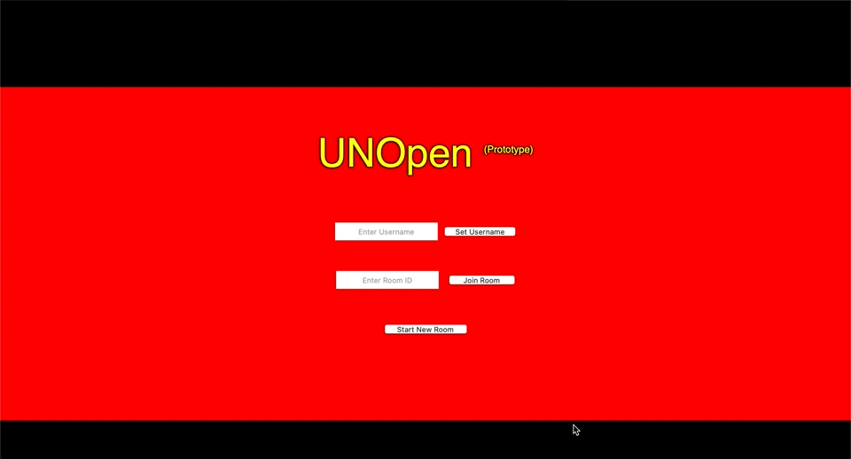

# project-11
project-11 created by GitHub Classroom

Team members:

Jing Wen

Diego Kervabon

Favian Flores

Ramon Torres

Lihong Chen

## Our Product-Vision:
FOR people ages 5 and up with access to the internet and an internet browser WHO are looking to socialize in a way
that is socially-distanced during this pandemic, UNOpen is a card game THAT is fun and easy to learn and UNLIKE
current mobile versions of this game OUR PRODUCT is free and open source and will run in your browser.

## Proof-of-concept prototype #1
User's can enter their desired username and can then either begin their own room, or enter a roomID to join an existing room.

## How to use:
Open a terminal window in the project folder

type "python3 -m http.server --directory templates"

go to 127.0.0.1:8000/homepage.html

## Proof-of-concept prototype #2(Our back up)
Here a quick look at our backup prototype webpage:

